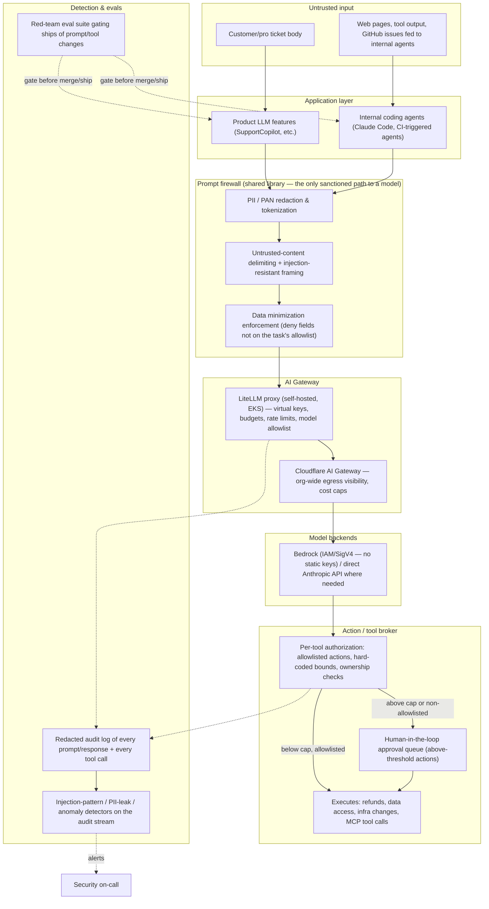

# Part 2B — AI/Agent Security Platform

Scope: both product LLM features (like the support copilot in Artifact E) and internal agents/MCP tooling
(Claude Code and friends, which write most of GreenScape's code). Today there is no guardrail layer around
either — every LLM call is a bespoke `Http::post` in whatever service needs it, with whatever ad hoc
handling that service's author happened to write. Artifact E is what that produces.

## Architecture

**Top two priorities, and why:** (1) the PII/PAN redaction chokepoint, because Artifact E shows raw card
numbers already reaching both a third-party model and application logs today — that's the highest-blast-
radius, already-occurring gap, and (2) bounding excessive agency (hard authorization caps + human-in-the-
loop), because that's the only gap in this assessment with a direct, automatic path to cash leaving the
business. Everything else here (gateway observability, injection framing, eval harness) matters but is
lower-urgency than "stop sending PANs to a model" and "stop letting a ticket trigger an uncapped refund."

## 1. AI Gateway / egress control

All LLM traffic — product features and internal Claude Code/agent sessions alike — routes through a
**self-hosted LiteLLM proxy running in EKS**, not direct calls from application code to a provider API. Why
LiteLLM over the alternatives:

- **Cloudflare AI Gateway** is a strong fit for org-wide egress visibility, caching, and cost caps, given
  GreenScape already trusts Cloudflare at the edge — but it's a metering/observability layer, not a place
  to inject business-specific guardrail logic (PII redaction rules, refund-cap enforcement). I'd run it
  **in addition to**, not instead of, a self-hosted proxy, for the egress-control and cost-ceiling
  properties.
- **Bedrock** is the right choice for *key custody specifically* — it authenticates via IAM/SigV4 instead of
  a static `ANTHROPIC_API_KEY` sitting in `env()` (exactly the pattern in Artifact E), and it fits an org
  that already operates an IAM boundary. Used as a **model backend** behind the proxy where Bedrock hosts
  the needed model, with direct Anthropic API access retained only where a needed capability isn't
  available via Bedrock.
- **LiteLLM** is the layer that actually needs to be custom to GreenScape: per-team/service virtual keys
  (not one shared key), budgets and rate limits per key, a model allowlist enforced at the proxy (block
  calls to any model not explicitly approved), and a full audit log of every prompt and response as a
  first-class feature — plus it's the natural place to plug in the redaction middleware in section 2, since
  it's code GreenScape controls rather than a black-box vendor gateway.

Key custody: API keys for any non-Bedrock provider live in Secrets Manager, injected into the LiteLLM proxy
only, with scheduled rotation; individual services never hold a provider API key directly — they hold a
scoped LiteLLM virtual key with a budget and an allowlist, revocable independently.

## 2. PII / sensitive-data guardrails

The chokepoint is a **shared "PromptBuilder" library** that is the only sanctioned way for any service to
construct a request to the LiteLLM proxy — enforced by blocking direct calls to model-provider domains from
application network policy (egress firewall rule) and a Semgrep rule flagging any `Http::post`/`fetch` to
`api.anthropic.com`/`bedrock` outside that one library.

- **Redaction/tokenization at construction time, not after.** The library applies pattern + NER-based
  detection (e.g., Microsoft Presidio, or a narrower regex set tuned to PAN/CPF/SSN/routing-number formats
  given GreenScape's known field types) and either strips or tokenizes matches before the request is
  built — so `SupportCopilot`'s mistake (full PAN in the prompt) becomes structurally impossible rather than
  a matter of the author remembering to minimize.
- **Data minimization is enforced, not advisory:** each call site declares an explicit allowlist of fields
  it's permitted to include (e.g., "support ticket summarization: booking id, amount, card_last4" — never
  `card_number`/`card_exp`/full address), and the library rejects fields not on that allowlist rather than
  passing through whatever the caller assembled.
- **Logs never see raw prompts/responses.** The gateway's audit log (section 5) stores redacted
  prompt/response text by default; anything requiring the unredacted version for a specific investigation
  goes through a separate, access-controlled, PCI/LGPD-scoped store with its own audit trail — never general
  application logs, which is exactly where Artifact E's `Log::info('support_copilot', ['prompt' =>
  $prompt, ...])` put it.

## 3. Prompt-injection defense

**Trust boundary model:** anything not authored by GreenScape's own backend logic is untrusted —
customer/pro-written ticket bodies, scraped web pages, tool output, and even a prior model turn's output in
a multi-step chain. Untrusted content is always wrapped in explicit delimiters and the system prompt states
plainly that content inside those delimiters is data, never instructions (the pattern used in the Artifact E
fix). This reduces, but does not eliminate, injection risk — prompting-based defenses are probabilistic, not
guarantees — so the real control is structural:

- **Untrusted content never reaches a privileged tool call directly.** A model's output that proposes an
  action always passes through the Action/tool broker (section 4) before anything executes — so even a
  fully successful injection can't exceed the broker's hard-coded bounds (an injected "refund $999,999"
  still gets clamped to the actual booking total and the autonomous-action cap, per the Artifact E fix).
- **For internal agents/MCP tooling specifically:** a coding agent that reads untrusted content (a GitHub
  issue body, a fetched web page, a linked ticket) in the same context window it uses to act with privilege
  is the indirect-injection risk to design against. Where feasible, separate "read untrusted content"
  sessions from "act with privileged tools" sessions — least-context, not just least-privilege — so a
  malicious instruction hidden in a GitHub issue can't ride along into a session that also holds
  deploy/infra credentials.

## 4. Tool / agent authorization & excessive agency

Every tool an agent or LLM feature can call is registered in the broker with an explicit spec: allowed
parameters, bounds, and required checks — enforced in code, independent of the model's own claims about
what it's entitled to do. Concretely, for the refund tool from Artifact E: max autonomous amount, must
reference a real booking owned by the ticket's customer, clamped to the booking's actual total, idempotent
per ticket.

- **Tiered autonomy, not binary trust.** Below-threshold, allowlisted actions execute automatically and are
  logged. Above-threshold or non-allowlisted actions route to a human-approval queue (e.g., a Slack
  approval bot) before executing — the model proposes, a human or the broker's bounds dispose.
- **MCP servers exposed to agents are treated as privileged service boundaries**, not internal
  conveniences: scoped, short-lived credentials per agent role (a coding agent's MCP session gets repo
  read/write and CI-trigger — not IAM/prod-DB access); an explicit per-role tool allowlist; every tool call
  audited; no MCP server holding blanket AWS admin credentials "for convenience." Apply the same network and
  authz review to an MCP server that any internal API would get — authenticated, least-privilege, logged.
- **No standing prod credentials in an agent's working context.** Infra changes an agent proposes go through
  the same Terraform plan/PR/apply pipeline as a human's, with the same CI gates from Part 2 — agents don't
  get a side channel that bypasses guardrails built for everyone else.

## 5. Detection & evals for the AI layer

- **Production detection** runs off the gateway's redacted audit log (section 1/2): pattern-based detectors
  for known injection phrasing, outputs that still contain PAN-shaped strings despite redaction (a
  defense-in-depth check on the redaction layer itself), and anomaly detection on refund
  volume/amounts specifically — a business-level signal that catches a successful attack even if the
  injection defenses themselves are bypassed. Feeds the same alerting pipeline as the rest of Part 2's
  detection coverage, not a separate silo.
- **Pre-ship evals, not manual spot-checks.** A red-team prompt library (known injection patterns, PII-
  exfiltration attempts, refund/amount-manipulation attempts, jailbreak attempts relevant to whatever action
  the feature can take) runs in CI against any change to a system prompt, tool definition, or LLM-backed
  feature, gating the merge on a pass-rate threshold — the same mechanism as the SAST/IaC gates from Part 2,
  applied to prompts instead of code.
- **Self-service, to avoid becoming the bottleneck.** The eval harness is a CLI/CI step any engineer or
  agent can run locally before opening a PR — the same one CI runs — so red-teaming a prompt change is as
  fast and as cheap as running a unit test, not a manual security-team review that engineering routes
  around under deadline pressure.
